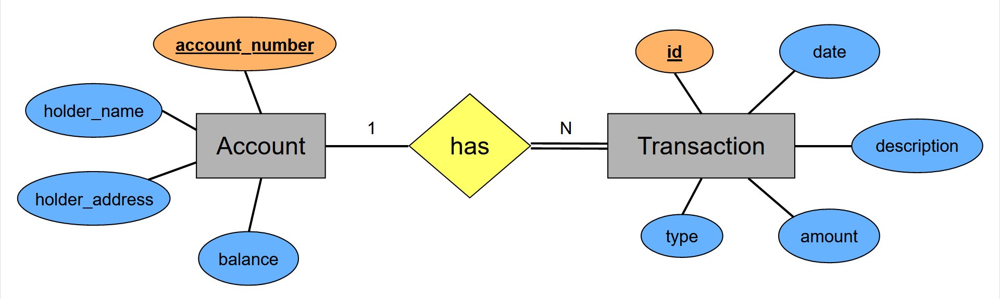

# Simple Banking Application - Back End 

This is a simple project to demonstrate the usage of **database transactions** in a multi-users environment. Four web services are exposed as APIs under the **accounts** and **transactions** resources 
in this application.

More information on the exposed web services can be found in the 
API documentations listed below.
- [Accounts API documentation](https://documenter.getpostman.com/view/25306703/2s8ZDR8kj9)
- [Transactions API documentation](https://documenter.getpostman.com/view/25306703/2s8ZDR8kjB)

#### Highlighted features of the application,

- The minimum amount that can be deposited or withdrawn is 100.
- The minimum amount that can be transferred from one account to another is 100.
- The minimum balance that can be present on an account is 100.

#### Entity relationship diagram of the database

## Used Technologies

- Java SE 11
- Jakarta Servlet 5.0
- Apache Tomcat 10.1.1
- Apache Maven 3.8.6
- MySQL Community Server 8.0.31
- Added dependencies to pom.xml
    - jakarta.servlet-api 5.0.0
    - lombok 1.18.24
    - yasson 2.0.4
    - jakarta.annotation-api 2.0.0
    - mysql-connector-j 8.0.31

#### Used Integrated Development Environment
- IntelliJ IDEA

## How to use ?
This project can be used by cloning the 
project to your local computer.

Make sure to create a **bank_db** database in the MySQL community server and add all the tables from the **database script.sql** file to it.
You can find the database script.sql for this project under the **resources** directory.

#### Clone this repository
1. Clone the project using `https://github.com/PubuduJ/simple-banking-app-back-end.git` terminal command.
2. Open the `pom.xml` file from **IntelliJ IDEA**, make sure to open this as a project.
3. In order to run this application, you have to set up a connection pool with the help of **JNDI** under the name of **jdbc/bank_db**.
4. You can use Jakarta EE application server or web container or servlet container to run the project. (Apache Tomcat 10.1.1 is recommended)
5. Use application context as **/bank/api**

## Credits
This project was carried out under the guidance of the [IJSE](https://www.ijse.lk/) Direct Entry Program 9.

## Version
v1.0.0

## License
Copyright &copy; 2023 [Pubudu Janith](https://www.linkedin.com/in/pubudujanith94/). All Rights Reserved. 
This project is licensed under the [MIT license](LICENSE.txt).